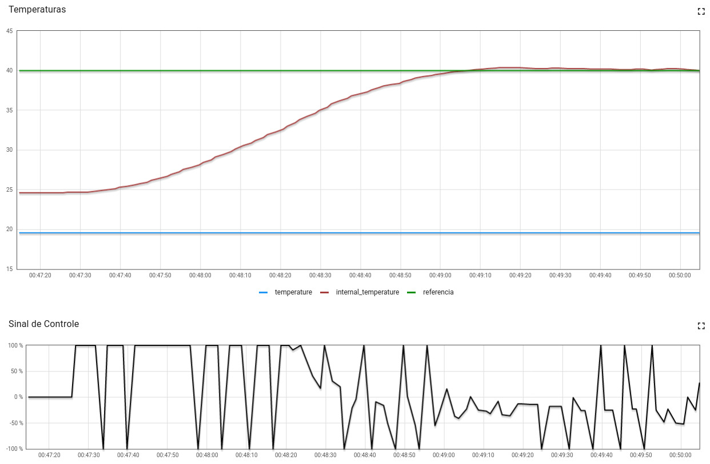
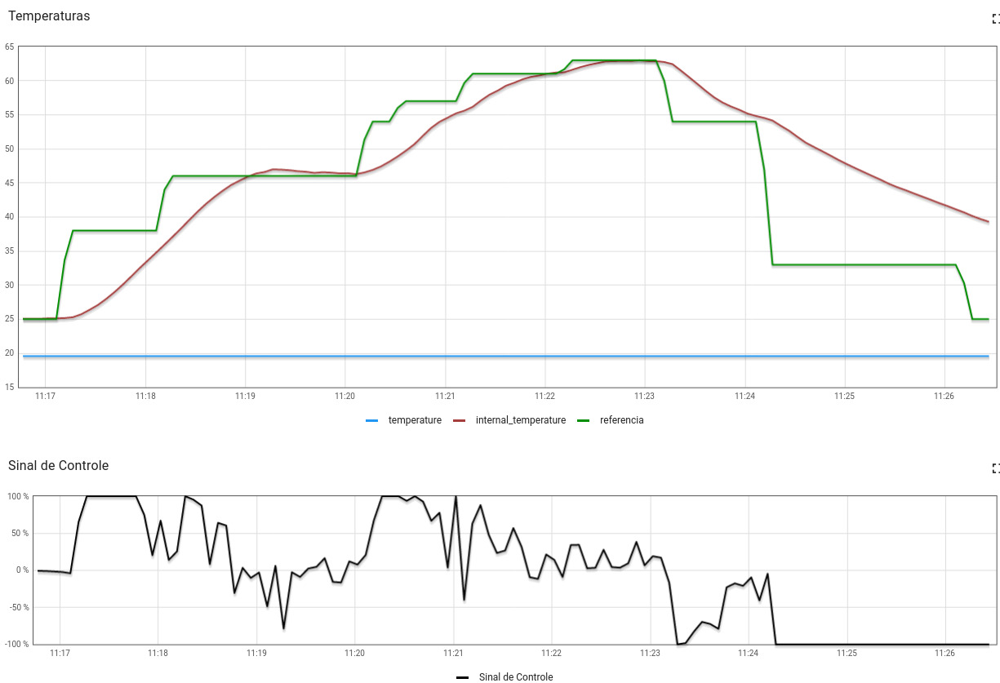

# Trabalho 2 FSE (2022-2)

|Nome|Matricula|
|:-:|:-:|
|João Pedro Moura Oliveira|190030879|

# Executando o programa

```sh
# Para executar o programa, é necessário antes compilar:
# Obs.: Crie antes a pasta /bin
$ mkdir -p bin
$ make

# Agora execute o binário que se encontra na pasta /bin
$ ./bin/bin [nome do arquivo csv de logs]
```

# Experimentos

## Temperatura Manual

Temperatura fixada em 40ºC, experimento durou cerca de 3min.


## Temperatura em Curva (Reflow)

Temperatura da curva de acordo com o [reflow](https://gitlab.com/fse_fga/trabalhos-2022_2/trabalho-2-2022-2/-/blob/main/curva_reflow.csv), experimento durou cerca de 10min.

